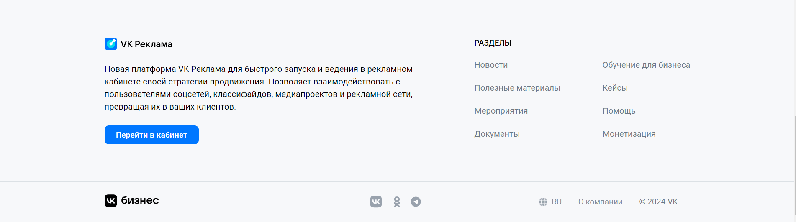
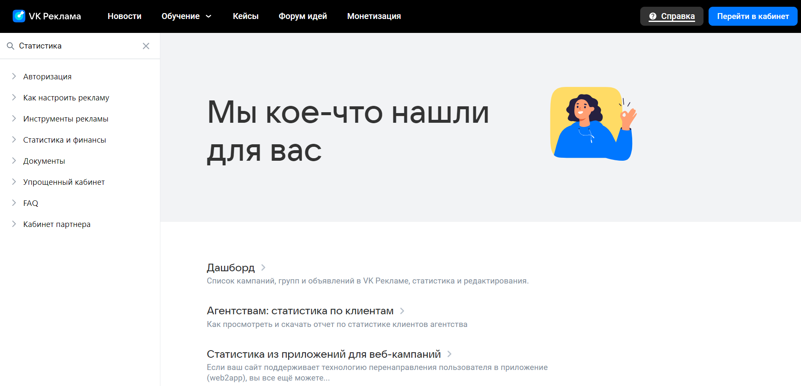
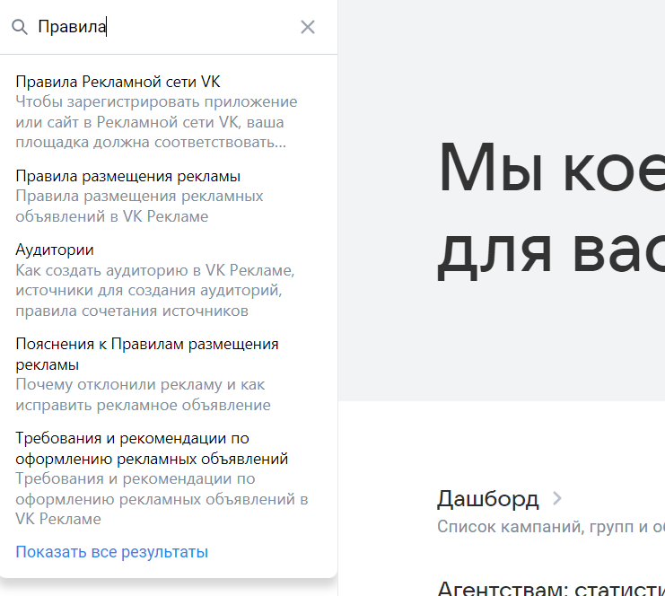

## Оглавление

1. [Футер](#футер)
2. [Справка](#справка)
3. [Лид-формы](#лид-формы)
4. [Пополнение счета](#пополнение-счета)

## Футер

- Футер присутствует на страницах:
    - https://ads.vk.com/
    - https://ads.vk.com/news
    - https://ads.vk.com/insights
    - https://ads.vk.com/events
    - https://ads.vk.com/cases
    - https://ads.vk.com/upvote
    - https://ads.vk.com/help
- В футере присуствуют:
    - Кнопка "перейти в кабинет", при нажатии ведет на https://id.vk.com/
    - логотип вк рекламы, при нажатии ведет на https://ads.vk.com/
    - логотип вк бизнес, при нажатии ведет на https://vk.company/ru/company/business/
    - заголовок "разделы" и, соответственно, разделы, каждый из которых ведет на соответствующий раздел
    - иконки соц сетей, каждая из которых ведет на сообщество вк рекламы в данной соц сети (вк, одноклассники, телеграм)
    - текст "О компании", при нажатии ведет на https://vk.company/ru/
    - текст "RU"/"EN", при всплывает меню с выбором языка 
        - при нажатии на "English" в меню ведет на https://ads.vk.com/en
        - при нажатии на "Русский" в меню ведет на https://ads.vk.com/

## Справка

### Главная страница

- при переходе на https://ads.vk.com/help открывается страница справки
- на странице справки присутствуют и ведут на соответствующую страницу карточки:
    - Авторизация
    - Как настроить рекламу
    - Инструменты рекламы
    - Статистика и финансы
    - Документы
    - Упрощенный кабинет
    - FAQ
    - Кабинет партнера

### Поиск на главной

- На странице справки присутствует поиск, при вводе строки, например "статистика", появляется короткий список результатов поиска, при нажатии "показать все результаты" происходит переход на https://ads.vk.com/help/search?search=Статистика
- При вводе строки "Статистика" в поиск и нажатии Enter также переходит на страницу https://ads.vk.com/help/search?search=Статистика

### Страница поиска

- При переходе на https://ads.vk.com/help/search?search=Статистика открывается страница поиска с текстом "Мы кое-что нашли для вас"
    - На странице поиска по слову "Статистика" присуствуют следующие ссылки, каждая из которых ведет на соответствующую статью:
        - Дашборд
        - Агентствам: статистика по клиентам
        - Статистика из приложений для веб-кампаний
        - Атрибуция конверсий для сайтов
        - Советы по запуску кампаний в Дзене
        - Карточки приложений
        - Статистика по монетизации

#### Поисковая строка на странице поиска

- При вводе строки, например "Правила" в поиск на странице поиска, появляется короткий список результатов поиска, при нажатии "показать все результаты" происходит переход на https://ads.vk.com/help/search?search=Правила

#### Поиск пустой строки

- При переходе на https://ads.vk.com/help/search открывается страница поиска с текстом "Мы правда старались, но ничего не нашли"

#### Список категорий 

- На странице поиска под поисковой строкой присутствует раскрывающийся список, при нажатии на элемент списка раскрывается спойлер с под-списком
    - При нажатии на элемент под-списка, который не является спойлером, например "FAQ">"Часто задаваемые вопросы", происходит переход на соответствующую статью, например https://ads.vk.com/help/articles/faq

## Лид-формы
### Основная страница

- При переходе на https://ads.vk.com/hq/leadads/leadforms открывается страница с лид формами

### Создание новой лид-формы, этап "Оформление"

#### Заполнение полей

- На странице лид-форм присутствует кнопка "создать лид-форму", при нажатии открывается конструктор лид форм
- При нажатии на кнопку "продолжить", ничего не заполняя, появляются предупреждения "Обязательное поле" у обязательных полей
- При вводе текста в какое либо поле, он появляется/изменяется на превью справа
- При вводе слишком длинного текста в поля, появляется предупреждение "Превышена максимальная длина поля" (в названии максимальная длина 255, хотя это и не написано)

#### Медиатека

- При нажатии "Загрузить логотип" открывается панель "Медиатека"
- При нажатии "Добавить обложку" открывается панель "Медиатека"
- Возможно загрузить картинку в медиатеке

#### Стили

- При нажатии на пипетку в разделе "стили", открывается окно выбора цвета

#### Первый экран формы

- При выборе варианте первого экрана в разделе "Первый экран формы" появляются соответствующие поля

### Создание новой лид-формы, этап "Вопросы"

- При Нажатии "Продолжить" на этапе "Оформление" происходит успешный переход на этап "Вопросы" (если заполнены все обязательные поля)

#### Добавление вопроса и ответов

- При нажатии "Добавить вопрос" появляются поля для конструкции вопроса
- При нажатии "Добавить ответ" появляется поле для добавления варианта ответа

#### Действия с ответами

- При нажатии на текст справа от "Тип вопроса" появляется список типов вопроса
- При нажатии на три точки справа от "Добавить ответ" появляется список заранее заготовленных ответов
- При выборе заранее заготовленного варианта ответа из списка заготовленных ответов появляется нередактируемое поле с этим вариантом ответа

#### Контактные данные, добавление

- При нажатии на "Добавить контактные данные" появляется попап с добавлением контактных данных, выбранные контактные данные появляются в соотвествующем разделе

#### Контактные данные, удаление

- При нажатии на иконку корзины справа от варианта контактных данных он удаляется
- При удалении всех полей возникает предупреждение "Минимальное количество полей: 1"

### Создание новой лид-формы, этап "Результат"

- При Нажатии "Продолжить" на этапе "Вопросы" происходит успешный переход на этап "Результат"
- При нажатии "Добавить сайт"/"Добавить телефон"/"Добавить промокод" появляется соотвествующее поле для заполнения

### Создание новой лид-формы, этап "Настройки"

- При Нажатии "Продолжить" на этапе "Результат" происходит успешный переход на этап "Настройки" (если заполнены все обязательные поля)
- При нажатии "Продолжить" без заполнения обязательных полей возникает предупреждение "Обязательное поле" у соответствующих полей

#### Сохранение созданной формы
- При нажатии "Сохранить" на этапе "Результат" при заполнении всех обязательных полей новая форма появляется в списке лид-форм

### Список лид-форм на основной странице лид-форм

- При выборе форм(ы) в списке форм сверху появляется кнопка для выпадающего списка "Действия"

### Редактирование лид-формы

- при редактировании лид формы возможен переход по этапам с помощью клика на соответствующий этап сверху

## Пополнение счета
### Действия с суммой пополнения

- При выполненной авторизации на странице, например https://ads.vk.com/hq/overview, присутствует иконка кошелька и сумма денег на счету в хедере, при нажатии на на иконку или сумму появляется попап с полями ввода суммы
- При нажатии на кнопку "Пополнить счет" с пустыми полями появляется предупреждение "Обязательное поле"
- При нажатии на кнопку "Пополнить счет" с слишком большой суммой (более 200_000) появляется предупреждение "уменьшите сумму" (почему то с маленькой буквы, все остальные предупреждения до этого были с большой)
- При нажатии на кнопку "Пополнить счет" с слишком малаенькой суммой (менее 600) появляется предупреждение "Минимальная сумма 600,00 ₽" 
- При нажатии на кнопку "Пополнить счет" с корректной суммой появляется выбор способов оплаты
### Способы пополнения

- Нажатие на каждый метод оплаты меняет контент модального окна на соответствующий:
    - Оплата картой - поля "Номер карты", "Срок действия", "cvv/cvc"
    - СБП - генерируется QR код для оплаты
    - Другие способы оплаты - открывается больше способов оплаты
